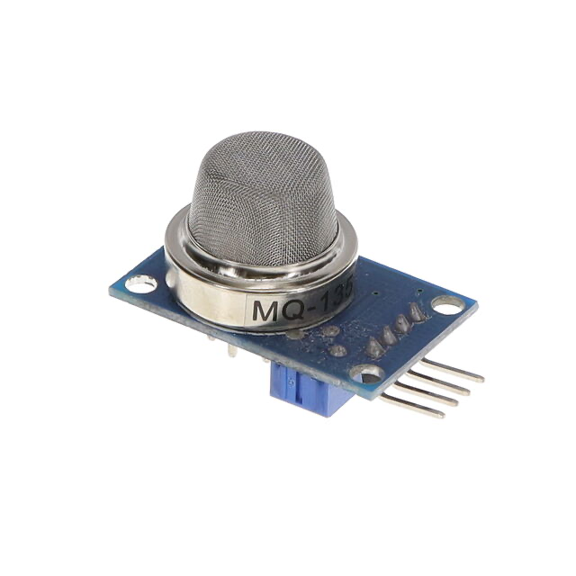
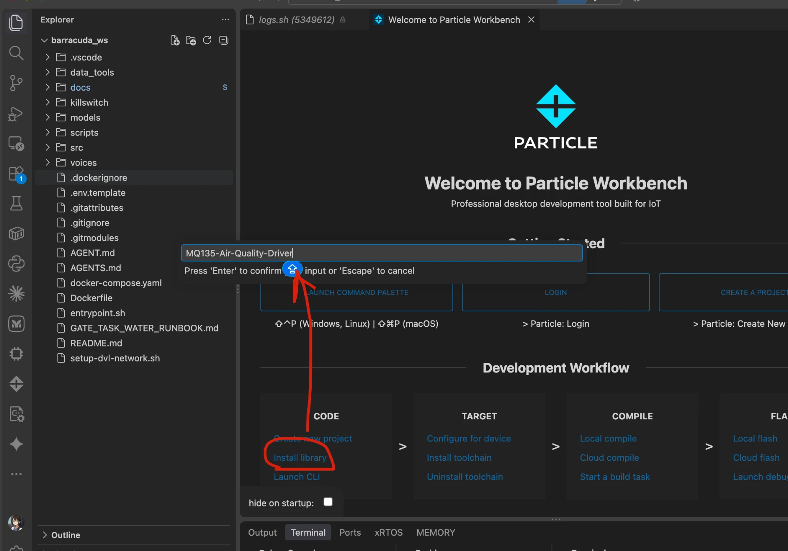

# MQ135-Air-Quality-Driver

MQ-135 air quality / hazardous gas sensor driver for **Particle** (Photon,
Argon, Boron, P1, Electron) **and Arduino** (Uno, Nano, Mega, and, with
`setADC()`, ESP32 / SAMD).

Converts the sensor's analog output to resistance and to a gas concentration
in ppm (CO2-equivalent by default) using the datasheet curve, with optional
temperature/humidity correction.

<p align="center">
  
</p>

## Hardware

Any MQ-135 breakout works. One ready-made module is the Olimex SNS-MQ135:
https://www.digikey.com/en/products/detail/olimex-ltd/SNS-MQ135/21662411

### Wiring

| MQ-135 module | Board |
|---------------|-------|
| VCC           | 5V |
| GND           | GND |
| AOUT          | A0 (through a divider on 3.3V boards, see below) |
| DOUT          | not used |

The library auto-selects the ADC for the board it compiles on: 12-bit / 3.3V on
Particle, 10-bit / 5V on a classic Arduino. For any other board (ESP32, SAMD,
3.3V AVR, external ADC), set it yourself:

```cpp
gas.setADC(4095, 3.3); // full-scale counts, reference volts
```

**ADC voltage warning (3.3V boards).** MQ-135 modules run at 5V and AOUT can
swing above 3.3V. Particle/ESP32 analog pins are 3.3V max. Put AOUT through a
resistor divider (e.g. 3.3k top / 1.8k bottom ≈ ratio 2.83) so the pin stays
under its reference, then tell the driver the ratio:

```cpp
gas.setVoltageDivider(2.83); // Vsensor / Vpin
```

On a 5V Arduino, AOUT connects directly and the divider stays at 1.0.

## Install in VS Code

### Particle (Particle Workbench)

1. Install the **Particle Workbench** extension from the VS Code Marketplace.
2. Open the command palette (Cmd/Ctrl+Shift+P) → **Particle: Create Project**
   (or open an existing one).
3. Command palette → **Particle: Install Library**, type
   `MQ135-Air-Quality-Driver`, press Enter. It is added to `project.properties`.
4. `#include "MQ135.h"` in your source, then **Particle: Compile/Flash** from
   the palette.

<p align="center">
  
</p>

You can also add it from the terminal in your project folder:

```bash
particle library add MQ135-Air-Quality-Driver
```

### Arduino (PlatformIO in VS Code)

Add the GitHub repo as a dependency in `platformio.ini`:

```ini
lib_deps = https://github.com/wuisabel-gif/MQ135-Air-Quality-Driver.git
```

### Arduino IDE / Arduino for VS Code

Download the repo as a ZIP from GitHub, then in the Arduino IDE:
**Sketch → Include Library → Add .ZIP Library** and pick the downloaded file.

## Usage

```cpp
#include "MQ135.h"

MQ135 gas(A0, 76.63); // pin, calibrated RZero

void setup() { Serial.begin(9600); }

void loop() {
    Serial.println(gas.getPPM());
    delay(10000);
}
```

## Calibration

RZero is the sensor resistance in clean air and differs per sensor. Run the
`Calibrate` example outdoors after warm-up, average the printed RZero, and pass
it to the constructor or `setRZero()`. A fresh sensor needs a 24-48h burn-in.

## API

- `MQ135(pin, rzero = 76.63, rload = 10.0)`
- `getResistance()` / `getCorrectedResistance(t, h)` — kOhm
- `getPPM()` / `getCorrectedPPM(t, h)` — ppm
- `getRZero()` / `getCorrectedRZero(t, h)` — calibration
- `setADC(counts, vref)`, `setSupplyVoltage(v)`, `setVoltageDivider(ratio)`, `setRZero(r)`

`t` is temperature in C, `h` is relative humidity in %.

## Other MQ sensors

The same class fits the resistive MQ family (MQ-2/3/4/5/6/8/131/135/136/137/138)
— change the `PARA`/`PARB` curve constants and recalibrate. MQ-7 and MQ-9 also
work but need an external heater-cycle. MG-811 and other EMF sensors do not.

## License

MIT
